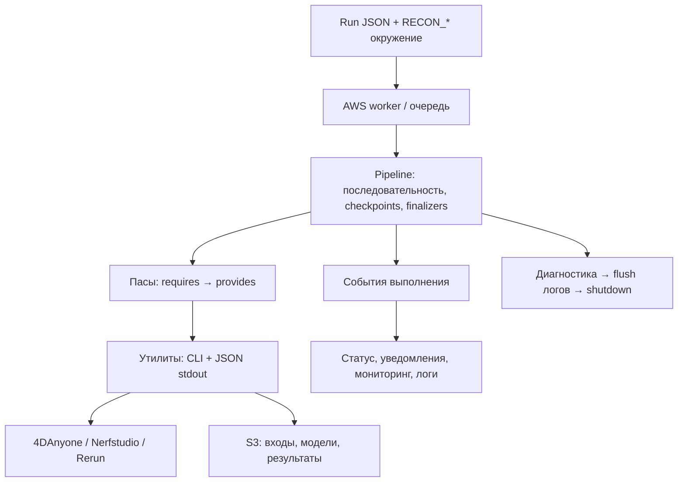

# Компоненты системы

Пайплайн превращает видео человека в синтетический мультикамерный датасет 4DAnyone. Затем выбранные моменты времени экспортируются в формат Nerfstudio, а Splatfacto обучает отдельную статическую 3DGS-сцену для каждого кадра. Rerun — дополнительный артефакт визуализации датасета или обученной сцены.

## Границы компонентов

| Компонент | Ответственность | Код |
| --- | --- | --- |
| Переносимый run document | Выбор стадий, кадров, артефактов и облачных ресурсов; schema v7 | `run_document.py`, `workers/aws/config.py` |
| Окружение машины | Пути к инструментам, workspace, версии; материализация JSON в runtime config | `environment.py`, `environment_cli.py` |
| Worker / очередь | Отдельный процесс, request/status/log, последовательные задания, политика остановки App | `workers/aws/job.py`, `worker.py`, `queue.py` |
| Ядро | Проверка контрактов, последовательное выполнение, checkpoints, lifecycle events и finalizers | `core/core.py`, `core/checkpoints.py` |
| Пасы | Адаптация конфигурации и артефактов в аргументы утилиты; возврат `PassResult` | `datasets/*/passes`, `reconstructions/*/passes`, `artifacts/*/passes`, `workers/aws/passes` |
| Утилиты | Самостоятельные операции; явные CLI-параметры, JSON progress/result, диагностика stderr | `utilities/` |
| Recovery и S3 publication | Fingerprint параметров, проверка файлов, публикация bundles и восстановление | `workers/aws/recovery.py`, `utilities/storage/s3/bundles.py` |
| Observers | Console, status.json, SNS/Telegram, snapshot ресурсов, периодическая S3-диагностика | `workers/aws/observers.py`, `persistence.py`, `cloudwatch.py` |
| Finalizers | Сохранить диагностику и логи, затем при необходимости остановить SageMaker App | `workers/aws/finalizers`, `persistence.py`, `cloudwatch.py` |

Пути в таблице даны относительно `src/recon_pipeline/`.

## Управление и вычисления

`build_aws_pipeline(worker, config, job_dir, status, *, force=False, log_session=None)` — composition root. Он выбирает пасы по конфигу и добавляет S3 upload после каждого паса с восстанавливаемыми файлами, если `upload_results=true`.

`Pipeline.prepare()` проверяет порядок и доступность артефактов, но не запускает операции. Это последовательный список, а не планировщик DAG: события наблюдают за работой, но не ставят новые вычисления в очередь. Обучение разных кадров также идёт последовательно.

Утилиты не читают run document, не импортируют worker/config и не читают `RECON_*`. Пасы передают им конкретные параметры и выбирают Python нужного окружения. Для AWS-утилит остаётся стандартная цепочка AWS credentials из SDK.

## Три разных пространства имён

- `experiment_name` — каталог результатов и S3 prefix эксперимента.
- `job_id` — каталог request/status/log процесса worker.
- `queue_id` — каталог и идентификатор процесса очереди из нескольких конфигов.

Изменение `job_id` не создаёт новый эксперимент. Для независимого результата нужен новый `experiment_name`.

## Где начать изучение кода

[Composition root](https://github.com/vinneyto/4da_3dgs_pipeline/blob/main/src/recon_pipeline/workers/aws/pipeline.py) → [ядро](https://github.com/vinneyto/4da_3dgs_pipeline/blob/main/src/recon_pipeline/core/core.py) → [API пасов](../reference/passes.md) → [CLI утилит](../reference/utilities.md).
