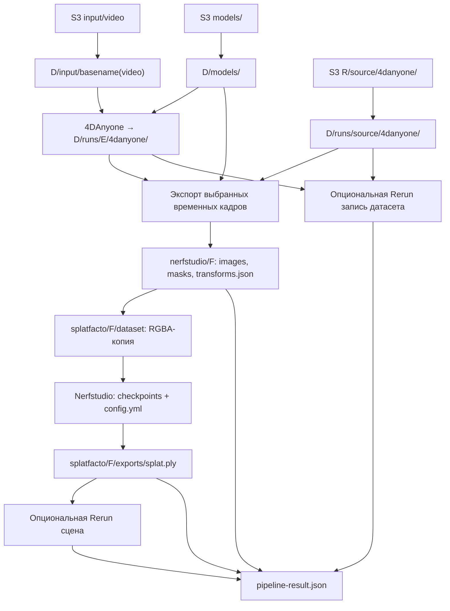
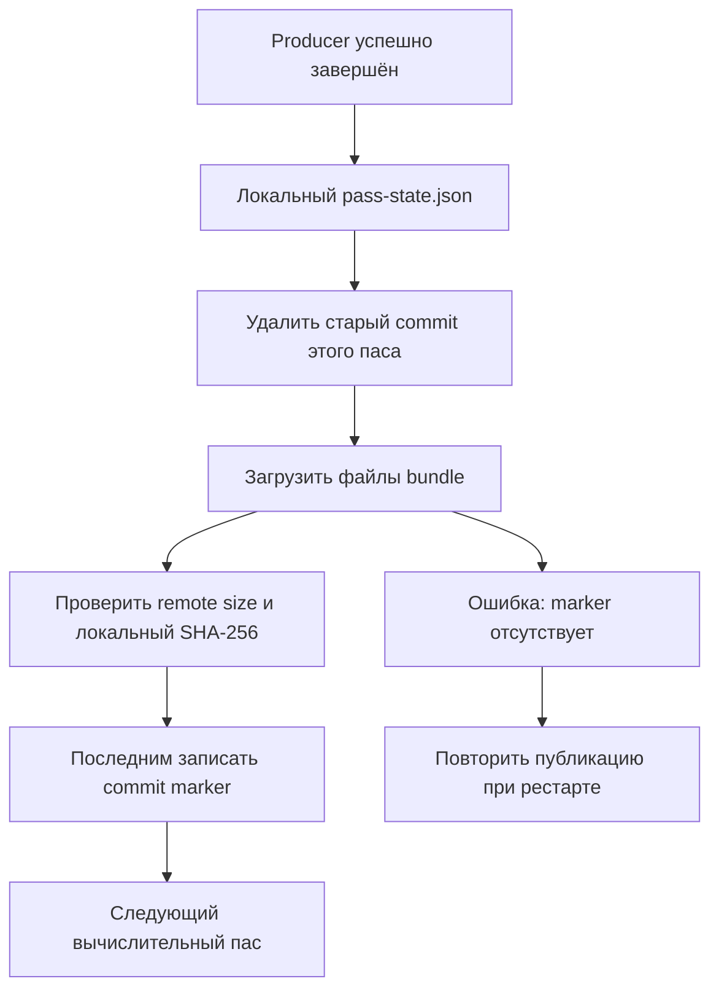

# Поток данных и хранение

В обозначениях ниже `D=$RECON_DATA_ROOT`, `E=experiment_name`, `F=frame_NNN`, `R=aws_worker.bucket.runs_prefix`. По умолчанию `R=runs`. Локальные пути появляются из окружения машины; в run JSON их нет.

## Вычислительный поток

`frame_NNN` означает момент времени, а не номер камеры. Внутри одного экспортированного кадра есть изображения этого момента со всех синтетических камер. Для каждого выбранного кадра обучается отдельная статическая сцена.

## Когда что сохраняется

| Момент | Источник → назначение | Что сохраняется / загружается |
| --- | --- | --- |
| `start` | JSON → `D/jobs/job_id/request.json` | Snapshot запроса для detached worker; затем `status.json` и `pipeline.log` |
| До выполнения пасов, при загрузке checkpoint store | S3 `R/E/.recon-pipeline/commits/` → локальный эксперимент | Восстановление подтверждённых bundles текущего плана, проверка размеров и SHA-256, перенос путей на новую машину |
| `aws-preflight` | STS / S3 / SageMaker / notifications | Проверка доступности ресурсов; write probe создаёт временный объект в `.access-check/` |
| `s3-download-input`, только при включённом dataset | S3 `input_prefix/video` → `D/input/basename(video)` | Входное видео; вложенный S3-путь локально сворачивается до имени файла |
| `s3-sync-models` | S3 `models_prefix/` → `D/models/` | Кеш весов. При `sync_models=false` используется локальный каталог |
| `s3-restore-experiment:source` | S3 `R/source/` → `D/runs/source/4danyone/` | Генерация источника для exports без нового inference; commit bundle либо legacy prefix |
| `prepare-experiment` | Настройки → `D/runs/E/pipeline-config.json` | Snapshot переносимых настроек; каталог эксперимента |
| `fourdanyone-inference` | Видео + веса → `D/runs/E/4danyone/` | Генерация upstream, включая `metadata.json`, `cameras.json`, данные для экспорта; локальный `inference-request.json` рядом с generation содержит конкретные paths |
| `nerfstudio-export` | 4DAnyone source → `D/runs/E/nerfstudio/F/` | Статический мультикамерный датасет каждого кадра: transforms, изображения, маски и данные upstream |
| `splatfacto:F` | Экспортированный dataset → `D/runs/E/splatfacto/F/` | RGBA-копия, training outputs/checkpoints, TensorBoard, train/export logs, полный SH PLY, `experiment_manifest.json` |
| `splatfacto-rerun:F` | PLY + dataset + training run → `splatfacto/F/rerun/` | `reconstruction.rrd` и вспомогательные данные записи |
| `rerun-export` | Генерация источника → `rerun/E.rrd` | Камеры, изображения, скелет/анимация датасета |
| `write-run-manifest` | Артефакты context → `pipeline-result.json` | Итоговые datasets, reconstructions, recordings и длительности |
| После успешного producer | Локальные файлы → S3 `R/E/` | При `upload_results=true`: отдельный `s3-upload:<producer-id>` публикует его bundle до следующего вычислительного паса |
| Во время выполнения и в finalizer | job status/report/logs → `R/E/.recon-pipeline/attempts/attempt_id/` | Диагностика текущей попытки и общий `.recon-pipeline/status.json` |

Пропущенный по checkpoint producer не переписывает результаты. Инфраструктурные пасы без валидатора checkpoint выполняются снова.

## Надёжная публикация одного паса

Commit лежит в `R/E/.recon-pipeline/commits/<sha256(pass_id)>.json`. Он содержит список файлов, размеры, SHA-256, fingerprint и portable checkpoint. Успешная загрузка части файлов ещё не означает завершённую публикацию. При восстановлении проверяется SHA-256 скачанных файлов перед восстановлением checkpoint.

Во время upload код сверяет remote `ContentLength` и неизменность локального digest; это не отдельная проверка SHA-256 удалённого объекта на стороне S3. SHA-256 проверяется по содержимому при download/recovery.

Recovery переносит пути внутри checkpoint values, но не переписывает содержимое скачанных JSON/YAML manifests: в них могут оставаться абсолютные пути исходной машины.

Это последовательная публикация с marker, а не транзакция всего S3 prefix. Лишние старые объекты могут остаться; актуальный набор определяет commit текущего плана.

## Локальная структура

| Путь относительно `D` | Содержимое |
| --- | --- |
| `input/` | Входные видео |
| `models/` | Общий кеш весов, включая лицензированные SMPL-X assets |
| `environment/` | `requirements-lock.txt` и locks отдельных окружений |
| `jobs/job_id/` | `request.json`, `status.json`, `pipeline.log`, PID/служебные файлы, attempt report |
| `runs/E/pipeline-config.json` | Параметры эксперимента без machine paths |
| `runs/E/.recon-pipeline/pass-state.json` | Локальные результаты завершённых пасов |
| `runs/E/4danyone/` | Генерация 4DAnyone |
| `runs/E/nerfstudio/F/` | Исходный статический dataset |
| `runs/E/splatfacto/F/dataset/` | Private RGBA training copy |
| `runs/E/splatfacto/F/nerfstudio_outputs/` | Run Nerfstudio: конфиг, checkpoints, transforms, TensorBoard |
| `runs/E/splatfacto/F/exports/splat.ply` | Полная Gaussian PLY с SH-коэффициентами |
| `runs/E/splatfacto/F/logs/` | `train.log`, `export.log` |
| `runs/E/splatfacto/F/rerun/reconstruction.rrd` | Запись обученной сцены |
| `runs/E/rerun/E.rrd` | Запись датасета |
| `runs/E/pipeline-result.json` | Итоговый manifest |

## Логи и остановка

При включённом CloudWatch worker отправляет логи в настроенную группу, создаёт потоки попытки и использует локальный spool для повторов. S3 observer примерно раз в 60 секунд сохраняет диагностический report и статус; без исправного CloudWatch — также хвосты последних логов. Finalizer сохраняет полную диагностику перед shutdown. При исправном CloudWatch `--skip-logs` отключает отдельную диагностическую копию логов; файлы логов внутри опубликованных вычислительных bundles всё равно входят в эти bundles.

Если публикация результатов/диагностики или flush CloudWatch не удалась, автоматическая остановка SageMaker откладывается, чтобы дать возможность сохранить локальные данные. Уведомления сами по себе не являются подтверждением публикации. Подробнее: [worker и восстановление](./worker.md).

Источники: [pipeline.py](https://github.com/vinneyto/4da_3dgs_pipeline/blob/main/src/recon_pipeline/workers/aws/pipeline.py), [bundles.py](https://github.com/vinneyto/4da_3dgs_pipeline/blob/main/src/recon_pipeline/utilities/storage/s3/bundles.py), [persistence.py](https://github.com/vinneyto/4da_3dgs_pipeline/blob/main/src/recon_pipeline/workers/aws/persistence.py).
