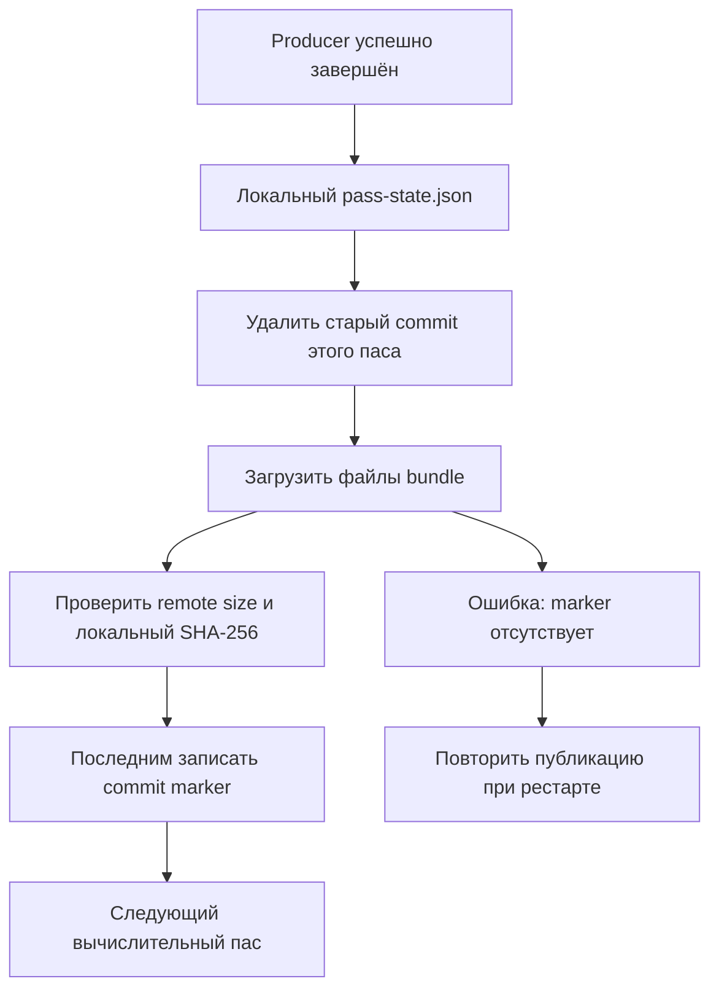

# Поток данных и хранение

В обозначениях ниже `D=$RECON_DATA_ROOT`, `E=experiment_name`, `F=frame_NNN`, `R=aws_worker.bucket.runs_prefix`. По умолчанию `R=runs`. Локальные пути появляются из окружения машины; в run JSON их нет.

## Поток выполнения и сохранения

Схема читается сверху вниз: имя над шагом — короткий идентификатор операции, стрелка — передаваемые или сохраняемые данные. Пути не включены в подписи; они приведены в [справочнике хранения](#локальная-структура). Широкую схему можно прокручивать горизонтально.

`Worker` управляет порядком, `Утилиты` выполняют операции и записывают файлы. Блоки `opt` выполняются только при включённой функции. Сохранение результатов в S3 в схеме предполагает `upload_results=true`; при `false` остаются локальные файлы и checkpoints.

```mermaid
sequenceDiagram
  participant W as Worker
  participant U as Утилиты
  participant L as Локальный диск
  participant S as S3
  participant C as CloudWatch

  Note over W: nowrap: start
  W->>L: Состояние задания
  Note over W,L: Request, status и pipeline log

  opt CloudWatch включён — во время всей работы
    W->>L: Spool логов
    W->>C: Логи попытки
  end

  opt Облачное восстановление включено
    Note over W: nowrap: s3-recover-run
    W->>U: Восстановить текущий план
    S->>U: Commit markers и результаты
    U->>L: Восстановленные файлы и checkpoints
    Note over U,L: Проверка размеров и SHA-256, перенос путей
  end

  Note over W: nowrap: aws-preflight
  W->>U: Проверить доступ к ресурсам
  U->>S: Проверка чтения и временная запись
  Note over W,U: Также STS, SageMaker и каналы уведомлений

  opt Новый датасет включён
    Note over W: nowrap: s3-download-input
    S->>U: Входное видео
    U->>L: Входное видео
  end

  Note over W: nowrap: s3-sync-models
  opt sync_models включён
    S->>U: Веса моделей
    U->>L: Кеш моделей
  end
  Note over U,L: Иначе используется локальный кеш

  opt Нужна генерация существующего источника
    Note over W: nowrap: s3-restore-experiment
    S->>U: Генерация источника
    U->>L: Генерация источника
    Note over U,L: Inference commit или legacy generation
  end

  Note over W: nowrap: prepare-experiment
  W->>U: Переносимые настройки
  U->>L: Настройки эксперимента
  W->>L: Checkpoints
  Note over W: nowrap: s3-upload
  L->>U: Настройки эксперимента
  U->>S: Bundle и затем commit marker

  opt Новый датасет включён
    Note over W: nowrap: fourdanyone-inference
    L->>U: Входное видео и кеш моделей
    U->>L: Запрос inference
    U->>L: Генерация
    W->>L: Checkpoints
    Note over W: nowrap: s3-upload
    L->>U: Генерация
    U->>S: Bundle и затем commit marker
  end

  opt Экспорт Nerfstudio включён
    Note over W: nowrap: nerfstudio-export
    L->>U: Генерация или генерация источника
    U->>L: Датасеты
    Note over U,L: Выбранные временные кадры, все камеры
    W->>L: Checkpoints
    Note over W: nowrap: s3-upload
    L->>U: Датасеты
    U->>S: Bundle и затем commit marker
  end

  opt Реконструкция включена
    loop Для каждого выбранного кадра
      Note over W: nowrap: splatfacto
      L->>U: Датасеты
      U->>L: RGBA-копия
      U->>L: Обученная сцена
      U->>L: Полная PLY
      U->>L: Логи реконструкции
      U->>L: Manifest кадра
      W->>L: Checkpoints
      Note over W: nowrap: s3-upload
      L->>U: Все результаты реконструкции кадра
      U->>S: Bundle и затем commit marker

      opt Rerun сцены включён
        Note over W: nowrap: splatfacto-rerun
        L->>U: Полная PLY, RGBA-копия и обученная сцена
        U->>L: Rerun сцены
        W->>L: Checkpoints
        Note over W: nowrap: s3-upload
        L->>U: Rerun сцены
        U->>S: Bundle и затем commit marker
      end
    end
  end

  opt Rerun датасета включён
    Note over W: nowrap: rerun-export
    L->>U: Генерация или генерация источника
    U->>L: Rerun датасета
    W->>L: Checkpoints
    Note over W: nowrap: s3-upload
    L->>U: Rerun датасета
    U->>S: Bundle и затем commit marker
  end

  Note over W: nowrap: write-run-manifest
  W->>U: Артефакты и длительности из context
  U->>L: Manifest запуска
  W->>L: Checkpoints
  Note over W: nowrap: s3-upload
  L->>U: Manifest запуска
  U->>S: Bundle и затем commit marker

  Note over W,S: S3-диагностика также сохраняется примерно раз в 60 секунд
  Note over W: nowrap: s3-save-diagnostics
  W->>L: Отчёт попытки
  L->>U: Состояние задания, отчёт и логи
  U->>S: Диагностика попытки и общий статус
  Note over U,S: Полная диагностика перед остановкой, в том числе при ошибке

  opt CloudWatch включён
    Note over W: nowrap: cloudwatch-flush
    W->>C: Оставшиеся логи
  end
  Note over W: nowrap: sagemaker-shutdown
  Note over W,C: Применить policy только после сохранения данных и логов
```

После каждого producer сначала сохраняется локальный checkpoint, затем выполняется его `s3-upload`; следующий вычислительный пас начинается только после успешной публикации. Здесь `s3-upload`, `splatfacto`, `splatfacto-rerun` и `s3-restore-experiment` — короткие имена: полные IDs дополнительно содержат producer, номер кадра или имя источника. `start` и `s3-recover-run` — операции worker до выполнения пасов, остальные названия соответствуют пасам или finalizers.

При восстановлении валидный producer пропускается вместе с подтверждённой публикацией. Инфраструктурные пасы без валидатора checkpoint выполняются снова. При ошибке цепочка вычислений останавливается, но finalizers сохранения диагностики и логов всё равно запускаются.

`frame_NNN` означает момент времени, а не номер камеры. Внутри одного экспортированного кадра есть изображения этого момента со всех синтетических камер. Для каждого выбранного кадра обучается отдельная статическая сцена.

## Надёжная публикация одного паса

Commit лежит в `R/E/.recon-pipeline/commits/<sha256(pass_id)>.json`. Он содержит список файлов, размеры, SHA-256, fingerprint и portable checkpoint. Успешная загрузка части файлов ещё не означает завершённую публикацию. При восстановлении проверяется SHA-256 скачанных файлов перед восстановлением checkpoint.

Во время upload код сверяет remote `ContentLength` и неизменность локального digest; это не отдельная проверка SHA-256 удалённого объекта на стороне S3. SHA-256 проверяется по содержимому при download/recovery.

Recovery переносит пути внутри checkpoint values, но не переписывает содержимое скачанных JSON/YAML manifests: в них могут оставаться абсолютные пути исходной машины.

Это последовательная публикация с marker, а не транзакция всего S3 prefix. Лишние старые объекты могут остаться; актуальный набор определяет commit текущего плана.

## Локальная структура

Имена данных в первом столбце совпадают с подписями стрелок основной схемы. Пути даны относительно `D`; файлы результатов публикуются под теми же относительными путями внутри S3 prefix `R/E`.

| Данные | Локальный путь | Содержимое |
| --- | --- | --- |
| Входное видео | `input/basename(video)` | Вход из S3 `input_prefix/video`; вложенный S3-путь локально сворачивается до имени файла |
| Кеш моделей | `models/` | Общие веса, включая лицензированные SMPL-X assets; источник — S3 `models_prefix` |
| Состояние задания | `jobs/job_id/` | `request.json`, `status.json`, `pipeline.log`, PID и служебные файлы |
| Spool логов | `jobs/job_id/cloudwatch/` | Очередь CloudWatch для повторной отправки на том же диске |
| Настройки эксперимента | `runs/E/pipeline-config.json` | Переносимые настройки без machine paths |
| Checkpoints | `runs/E/.recon-pipeline/pass-state.json` | Локальные результаты завершённых пасов |
| Запрос inference | `runs/E/inference-request.json` | Конкретные runtime paths; сохраняется рядом с generation и не входит в её bundle |
| Генерация | `runs/E/4danyone/` | Metadata, cameras и данные 4DAnyone для экспорта |
| Генерация источника | `runs/source/4danyone/` | Уже существующая генерация другого или текущего эксперимента |
| Датасеты | `runs/E/nerfstudio/F/` | Images, masks и `transforms.json` каждого временного кадра |
| RGBA-копия | `runs/E/splatfacto/F/dataset/` | Private training copy с alpha по маске |
| Обученная сцена | `runs/E/splatfacto/F/nerfstudio_outputs/` | Nerfstudio config, checkpoints, transforms и TensorBoard |
| Полная PLY | `runs/E/splatfacto/F/exports/splat.ply` | Gaussian-сцена с полными SH-коэффициентами |
| Логи реконструкции | `runs/E/splatfacto/F/logs/` | `train.log`, `export.log` |
| Manifest кадра | `runs/E/splatfacto/F/experiment_manifest.json` | Training result, профиль и пути результатов кадра |
| Rerun сцены | `runs/E/splatfacto/F/rerun/` | `reconstruction.rrd` и вспомогательные данные |
| Rerun датасета | `runs/E/rerun/E.rrd` | Камеры, изображения и анимация датасета |
| Manifest запуска | `runs/E/pipeline-result.json` | Итоговые datasets, reconstructions, recordings и длительности |
| Отчёт попытки | `jobs/job_id/attempt-report.json` | Статус попытки, ошибка, текущий пас и длительности |

Диагностика в S3 хранится отдельно: `R/E/.recon-pipeline/attempts/attempt_id/` содержит report, status, request и нужные логи; общий статус — `R/E/.recon-pipeline/status.json`. Логи попытки в CloudWatch отправляются в группу из run config. Locks окружений находятся в `D/environment/` и относятся к установке машины, а не результатам запуска.

## Логи и остановка

При включённом CloudWatch worker отправляет логи в настроенную группу, создаёт потоки попытки и использует локальный spool для повторов. S3 observer примерно раз в 60 секунд сохраняет диагностический report и статус; без исправного CloudWatch — также хвосты последних логов. Finalizer сохраняет полную диагностику перед shutdown. При исправном CloudWatch `--skip-logs` отключает отдельную диагностическую копию логов; файлы логов внутри опубликованных вычислительных bundles всё равно входят в эти bundles.

Если публикация результатов/диагностики или flush CloudWatch не удалась, автоматическая остановка SageMaker откладывается, чтобы дать возможность сохранить локальные данные. Уведомления сами по себе не являются подтверждением публикации. Подробнее: [worker и восстановление](./worker.md).

Источники: [pipeline.py](https://github.com/vinneyto/4da_3dgs_pipeline/blob/main/src/recon_pipeline/workers/aws/pipeline.py), [bundles.py](https://github.com/vinneyto/4da_3dgs_pipeline/blob/main/src/recon_pipeline/utilities/storage/s3/bundles.py), [persistence.py](https://github.com/vinneyto/4da_3dgs_pipeline/blob/main/src/recon_pipeline/workers/aws/persistence.py).
